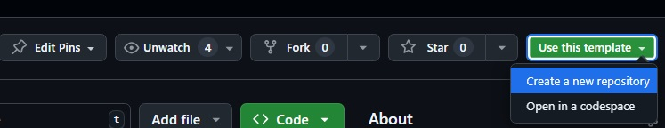

## Assignment Details

Using the [Open Library API](https://openlibrary.org/developers/api)
and the provided base project.

1. Create a user search form to search for books by title. 
1. Display top 10 results as a list of titles sorted by name.
1. Results should be displayed using Vue via Inertia.  Each result should also be a Vue component that display the title of the book.  When that book title is clicked the component should display the following additional information:
    - First year published
    - Median number of pages
    - Authors
    - First sentence 
    - An image of the book  
1. For the purpose of this test, all code you write should have test coverage and pass.
1. None of the tests should hit the actual api.
1. You are free to use any library you see fit.

### Provided Base Project
This provided base project uses Vue, Vite, Laravel and Inertia in a dockerized environment.
Feel free to use this project as a template for your assigment (DO NOT FORK this project).

#### Install Project Dependencies 

1. Install composer dependencies   `docker compose run --rm dev composer install`
1. Install npm dependencies   `docker compose run --rm dev npm install  --legacy-peer-deps && npm build`
